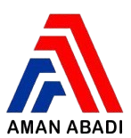

# PT. AMAN ABADI - Company Website



Website resmi PT. Aman Abadi - General Contractor & Supplier yang bergerak di bidang konstruksi umum dan supplier dengan pengalaman lebih dari 20 tahun sejak didirikan pada tahun 2003 di Bontang, Kalimantan Timur.

## 🏢 Tentang Perusahaan

PT. Aman Abadi adalah Perusahaan Swasta Nasional yang profesional, handal, inovatif, amanah dan terpercaya. Kami berkomitmen mendukung Program Pembangunan Nasional Indonesia di bidang infrastruktur, konstruksi dan supplier.

### 🎯 Visi

Mewujudkan dan menjadikan PT. Aman Abadi menjadi sebuah Perusahaan Swasta Nasional yang profesional, handal, inovatif, amanah dan terpercaya.

### 🚀 Misi

- Mendukung program pemerintah dalam Pembangunan Nasional di bidang infrastruktur dan konstruksi
- Menjaga hubungan kerja sama yang baik, jujur dan transparan dengan mitra bisnis
- Menjaga kualitas pekerjaan dan produk secara maksimal dengan tingkat akurasi dan tanggung jawab tinggi

## 🌟 Fitur Website

- ✅ **Responsive Design** - Kompatibel dengan semua perangkat
- ✅ **Modern UI/UX** - Desain profesional dan user-friendly
- ✅ **Profil Perusahaan** - Informasi lengkap tentang PT. Aman Abadi
- ✅ **Kata Pengantar Direktur** - Sambutan dari pimpinan perusahaan
- ✅ **Visi & Misi** - Tujuan dan komitmen perusahaan
- ✅ **Layanan Kami** - Detail layanan konstruksi dan konsultasi
- ✅ **Form Kontak** - Sistem komunikasi langsung
- ✅ **Karier** - Informasi lowongan pekerjaan

## 🛠️ Teknologi yang Digunakan

- **Frontend Framework**: React 18 + TypeScript
- **Build Tool**: Vite
- **Styling**: Tailwind CSS
- **Icons**: Lucide React
- **Linting**: ESLint
- **Package Manager**: npm/yarn

## 📋 Prasyarat

Pastikan Anda telah menginstal:

- [Node.js](https://nodejs.org/) (versi 16.0.0 atau lebih baru)
- [npm](https://www.npmjs.com/) atau [yarn](https://yarnpkg.com/)
- [Git](https://git-scm.com/)

## 🚀 Instalasi & Menjalankan Aplikasi

### 1. Clone Repository

```bash
# Clone repository dari GitHub
git clone https://github.com/adit1602/kontraktor-repo.git

# Masuk ke direktori proyek
cd kontraktor-repo
```

### 2. Install Dependencies

```bash
# Menggunakan npm
npm install

# Atau menggunakan yarn
yarn install
```

### 3. Menjalankan Development Server

```bash
# Menggunakan npm
npm run dev

# Atau menggunakan yarn
yarn dev
```

Aplikasi akan berjalan di `http://localhost:5173`

### 4. Build untuk Production

```bash
# Menggunakan npm
npm run build

# Atau menggunakan yarn
yarn build
```

### 5. Preview Build Production

```bash
# Menggunakan npm
npm run preview

# Atau menggunakan yarn
yarn preview
```

## 📁 Struktur Proyek

```
kontraktor-repo/
├── public/                 # File statis
├── src/
│   ├── assets/            # Gambar, logo, dll
│   │   ├── direktur.png   # Foto direktur
│   │   └── logo.png       # Logo perusahaan
│   ├── App.tsx            # Komponen utama
│   ├── main.tsx           # Entry point aplikasi
│   ├── index.css          # Global styles
│   └── vite-env.d.ts      # Type definitions
├── index.html             # HTML template
├── package.json           # Dependencies dan scripts
├── tailwind.config.js     # Konfigurasi Tailwind CSS
├── tsconfig.json          # Konfigurasi TypeScript
├── vite.config.ts         # Konfigurasi Vite
└── README.md              # Dokumentasi proyek
```

## 📝 Scripts yang Tersedia

- `npm run dev` - Menjalankan development server
- `npm run build` - Build aplikasi untuk production
- `npm run preview` - Preview build production
- `npm run lint` - Menjalankan ESLint untuk cek kode

## 🎨 Kustomisasi

### Mengubah Konten

1. **Informasi Perusahaan**: Edit bagian yang relevan di `src/App.tsx`
2. **Logo**: Ganti file di `src/assets/logo.png`
3. **Foto Direktur**: Ganti file di `src/assets/direktur.png`
4. **Warna**: Modifikasi di `tailwind.config.js` atau langsung di komponen

### Mengubah Styling

Website menggunakan Tailwind CSS untuk styling. Anda dapat:

- Mengubah warna dengan mengmodifikasi classes seperti `text-blue-700`, `bg-orange-500`
- Menambah komponen baru dengan mengikuti pattern yang ada
- Mengubah layout dengan memodifikasi grid dan flexbox classes

## 📞 Informasi Kontak

**PT. AMAN ABADI**

- 📍 Alamat: Jl. Mulawarman No 14 RT 10 Bontang Baru, Kalimantan Timur, Indonesia
- 📱 Telepon: 0858 23791
- 📧 Email: ptaman.abadi@yahoo.com
- 👨‍💼 Direktur: Zen Fanani

## 🤝 Kontribusi

Jika Anda ingin berkontribusi pada proyek ini:

1. Fork repository
2. Buat branch feature (`git checkout -b feature/AmazingFeature`)
3. Commit perubahan (`git commit -m 'Add some AmazingFeature'`)
4. Push ke branch (`git push origin feature/AmazingFeature`)
5. Buat Pull Request

## 📄 Lisensi

Proyek ini adalah milik PT. Aman Abadi. Semua hak cipta dilindungi.

## 🆘 Troubleshooting

### Error saat Install Dependencies

```bash
# Hapus node_modules dan package-lock.json
rm -rf node_modules package-lock.json
npm install
```

### Port 5173 sudah digunakan

```bash
# Jalankan dengan port berbeda
npm run dev -- --port 3000
```

### Build Error

```bash
# Pastikan semua dependencies terinstall
npm install
npm run lint
npm run build
```

---

**Dikembangkan dengan ❤️ untuk PT. Aman Abadi - Membangun Masa Depan Indonesia**
